# Anima で 2〜3 人を描き分けるプロンプトの書き方を 9 通り比べた

- 調査・生成日: 2026-10-09
- 対象モデル: [circlestone-labs/Anima](https://huggingface.co/circlestone-labs/Anima) ベース版（`anima-base-v1.0`）
- キャラクター LoRA: `kutara_anima.v12`（3 キャラを 1 つの LoRA に学習させたもの）

## 要約

- 9 方式 × 12 シーン × 4 seed、計 432 枚を生成して目視で判定した。
- **自然文でキャラを描写する方式が圧倒的に強い。** 自然文を含む上位 4 方式の成功率は 71〜81% だった。タグだけで書く 3 方式（`tags-only`、`name-then-appearance`、`tags-break`）は 2〜4%、ラベル付きのタグ列（`labeled-groups`）も 21% にとどまった。タグ主体の方式は人数こそ合うものの、髪型・眼鏡・服の色がキャラ間で入れ替わる。
- 成功率 1 位は `hybrid-tags-nl`（81%）だった。品質・人数・キャラ名・カメラ・背景をタグで先に書き、各キャラを「位置, 名前, 外見, 服装, 動作.」の自然文で続ける書き方である。2 人の構図では 28/28 で全部成功した。
- 現行スキルの位置ブロック（`skill-position-blocks`）は 71% で 4 位だった。項目別の正答率は最も高い（平均スコア 4.56）。ただし、相互作用のない 2 人並び（s01）では 4 枚とも「左右 2 枚の分割コマ」になった。同じくキャラごとにブロックを分ける `image-side-blocks` でも、同じ分割が起きた。
- 上位 4 方式どうしの差は、今回の枚数（各 48 枚）では統計的に有意とまでは言えない。はっきり差が出たのは「自然文あり」と「タグのみ」の間である。
- `BREAK` は効かなかった。`tags-break` の成功率は `tags-only` と同じ 1/48 である。
- 3 人の縦積み（s07）と、前景・遠景の極端なサイズ差（s08）は、どの方式でもほぼ成功しなかった。プロンプトの書き方だけでは届かない構図である。

## 背景と目的

Anima は Danbooru タグと自然文の両方で学習されたアニメ系の画像生成モデルである。テキストエンコーダに小型 LLM（Qwen3 0.6B）を使っているため、SDXL 系よりも自然文の指示がよく通る。一方で、2〜3 人の人物を描かせると「片方の髪色がもう片方に移る」「人数が増える」「左右が入れ替わる」といった失敗が今も起こる。

筆者はプロンプトを組み立てるための Claude Code スキル `anima-prompt` を作っており、複数人物については「位置ブロック」と呼ぶ書き方を推奨してきた。ただ、それが本当に最善なのかは確かめていなかった。そこで、ネット上で語られている書き方を集め、同じ条件で画像を生成して比べることにした。

この記事で答えたい問いは次の 3 つである。

1. 2〜3 人を描き分けるために、どんな書き方が提案されているか
2. それぞれの書き方は、難しい構図も含めて意図どおりの絵を出せるか
3. スキルにはどの書き方を推奨として載せるべきか

## 調査した指示方法

Hugging Face のモデルカードと Discussions、Civitai の記事、note、としあき diffusion Wiki、GitHub 上のプロンプトガイド、個人ブログを調べ、次の 9 系統に整理した。Reddit と X は本文を取得できなかったため出典から外している。

| # | 識別子 | 書き方の要点 | 主な出典 |
|---|---|---|---|
| 1 | `tags-only` | 人数タグとキャラごとのタグを、区切りなしでカンマ列挙する | [HF #93](https://huggingface.co/circlestone-labs/Anima/discussions/93)、[HKMC_AILab](https://note.com/hkmclab/n/n7611426be16a)、[nobin](https://note.com/nobinlog/n/n68ba3a86110f) |
| 2 | `name-then-appearance` | キャラ名の直後に `with ...` で外見を続ける（公式モデルカードの注意点） | [モデルカード](https://huggingface.co/circlestone-labs/Anima)、[HF #93](https://huggingface.co/circlestone-labs/Anima/discussions/93)、[HF #65](https://huggingface.co/circlestone-labs/Anima/discussions/65) |
| 3 | `nl-sentences` | 自然文だけで書く。キャラごとに文を分け、`The girl on the left is ...` のように位置付きの主語を毎文くり返す | [としあき Wiki](https://wikiwiki.jp/sd_toshiaki/Anima)、[しずのり](https://note.com/shizunori/n/n7b0cbc00fb0d)、[ai-prompting-guides](https://github.com/CalamitousFelicitousness/ai-prompting-guides/blob/main/docs/anima.md) |
| 4 | `hybrid-tags-nl` | 品質・人数・キャラ名・カメラ・背景をタグで先に書き、キャラの描写と位置を自然文で続ける | [モデルカード](https://huggingface.co/circlestone-labs/Anima)、[lulinaworks](https://lulinaworks.com/articles/anima-prompt-writing)、[Civitai 31037](https://civitai.com/articles/31037/guide-or-musing-poll-what-i-learnt-about-anima-some-useful-resources) |
| 5a | `skill-position-blocks` | 現行スキルの書き方。位置語を見出しにして、インデントした「自然文 1 文 + タグ列」をキャラごとに置く | 現行 `anima-prompt` スキル |
| 5b | `image-side-blocks` | `the image depicts 2 characters.` と画面構成を宣言し、`On the left of the image is <名前>, <タグ>.` でキャラを区切る | [HF #93](https://huggingface.co/circlestone-labs/Anima/discussions/93)、[HF #120](https://huggingface.co/circlestone-labs/Anima/discussions/120)、[HF #76](https://huggingface.co/circlestone-labs/Anima/discussions/76)、[Civitai 35368](https://civitai.com/articles/35368/the-ultimate-anima-prompting-guidebook-all-you-need) |
| 6 | `labeled-groups` | `the girl on the left: <タグ列>` のようにラベルとコロンを付け、改行でキャラを分ける | [lulinaworks](https://lulinaworks.com/articles/anima-prompt-writing)、[lilting.ch](https://lilting.ch/en/articles/anima-kanachan-lora-bleed-weight-sweep)、[HF #120](https://huggingface.co/circlestone-labs/Anima/discussions/120) |
| 7 | `interaction-relations` | キャラを 1 人 1 文で定義した後、相互作用を言い直し、最後に「誰がどこか」を再掲する | [Civitai 35368](https://civitai.com/articles/35368/the-ultimate-anima-prompting-guidebook-all-you-need)、[Yu1Ko/Anima-Prompt](https://github.com/Yu1Ko/Anima-Prompt/blob/main/references/anima-prompting.md)、[lilting.ch](https://lilting.ch/en/articles/anima-4char-band-qwen-encoder) |
| 8 | `tags-break` | SDXL の慣習どおり `BREAK` でキャラを区切る | [としあき Wiki](https://wikiwiki.jp/sd_toshiaki/Anima)（「使ってはいけない」と明記） |
| 9 | Regional Prompter などの領域指定 | 拡張機能で画面を領域に分け、領域ごとに別のプロンプトを当てる | [sd-webui-regional-prompter](https://github.com/hako-mikan/sd-webui-regional-prompter)、[sd-forge-couple](https://github.com/Haoming02/sd-forge-couple)、[Anima Regional Conditioning](https://github.com/Sen-sou/Comfyui-Anima-Regional-Conditioning)、[Anima LLLite Regional ControlNet](https://huggingface.co/Sen-sou/Anima-LLLite-Regional-Controlnet) |

各方式の補足:

- **1. tags-only**: 1 人の絵ならタグのみのほうが画質が安定するという報告がある（[HF #140](https://huggingface.co/circlestone-labs/Anima/discussions/140)）。一方で、複数人では属性が混ざりやすいという報告が多い。
- **2. name-then-appearance**: モデルカードの「Name a character, then describe their basic appearance. This is extra important when prompting for multiple characters.」に基づく。名前だけでは混ざった組み合わせが、外見を足して直った例が HF #93 にある。
- **3. nl-sentences**: しずのり氏は「記述は冗長でよい、しつこく指定する」と述べ、5 人の描き分けに成功している。自然文が長すぎると崩れるという報告もある（HF #140）。
- **4. hybrid-tags-nl**: モデルカードは「タグと自然文は任意の順で混ぜてよい」としている。HKMC_AILab の検証では、タグだけで混ざった 2 人が自然文を混ぜたら混ざらなくなった。
- **5b. image-side-blocks**: HF #76 には「左右の配置程度なら regional prompting は要らない。自然文で On the left side of the image... と書けばよい」という意見がある。一方 HF #202 では、身体接触や相互作用が入るとすぐ崩れると報告されている。
- **6. labeled-groups**: 改行の効果については意見が割れている。「特に何もしていない」（HF #93）という声もあれば、「タグの途中で改行すると追従が落ちる」（HF #120）という声もある。
- **7. interaction-relations**: Civitai のガイドブックは「各被写体を別の文で定義してから相互作用を言い直す」流れを推奨し、「服装を位置に割り当てる前に書く」ことを避けるべき例として挙げている。
- **8. tags-break**: Forge Neo の Anima 用テキスト処理（`backend/text_processing/anima_engine.py`）には BREAK でチャンクを分ける処理がない。拡張機能なしでは、BREAK は単なる英単語としてテキストエンコーダに渡る。今回は「効かないこと」を確かめる対照群として入れた。
- **9. 領域指定（対象外）**: Regional Prompter は 2026-09 に Forge Neo の Anima に対応した。ただし有効にするには、API の `alwayson_scripts` で拡張機能の引数を渡す必要がある。今回の生成環境（sdctl から Forge の txt2img API へプロンプト文字列だけを送る）では使えず、WebUI にも拡張機能が入っていないため、**比較の対象外**とした。領域どうしがお互いを認識しにくく、相互作用のある構図は不自然になりやすいという指摘もある。

なお、複数の出典に共通する注意点として「カンマの後にはスペースを入れる」がある。Qwen3 のトークナイザでは `a,b` と `a, b` のトークン列が変わるためである（[HF #184](https://huggingface.co/circlestone-labs/Anima/discussions/184)）。今回のプロンプトはすべてスペースありで書いた。

## 実験の方法

### キャラクター

LoRA `kutara_anima.v12` で学習した 3 人を使う。トリガーワードだけでは髪色などが安定しないため、外見を毎回書く。服の色をキャラごとに緑・赤・青に固定し、属性の混線を見分けやすくした。

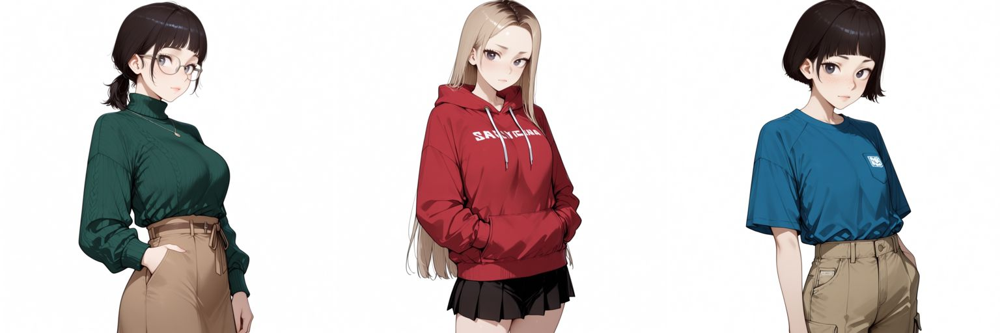

| キャラ | トリガー | 外見 | 服装（全シーン共通） |
|---|---|---|---|
| なつみ | `kutara natsumi` | 黒髪の低いポニーテール、ぱっつん前髪、丸眼鏡 | 緑のタートルネックセーター、茶色のロングスカート |
| さやか | `kutara sayaka` | 金髪ストレートのロングヘア、おでこ | 赤いパーカー、黒のプリーツスカート |
| あき | `kutara aki` | 黒髪ボブ、ぱっつん前髪、そばかす、平らな胸（タグは `futanari, flat chest`） | 青い T シャツ、カーキのカーゴパンツ |

なつみとあきはどちらも黒髪でぱっつん前髪なので、眼鏡と髪型（ポニーテールかボブか）で見分ける。この 2 人の取り違えも評価の対象になる。

### 構図シーン

易しい並び立ちから、肩車・逆さま・3 人の縦積みのような「普段まず描かれない」構図まで 12 シーンを用意した。

| ID | シーン | 難度 | 解像度 | 登場（位置） | 成功の条件 |
|---|---|---|---|---|---|
| s01 | 2人並び（基準） | 易 | 1344×768 | なつみ（On the left）、さやか（On the right） | 2人。左=なつみ（眼鏡・黒髪ポニーテール・緑セーター）が右手を挙げて手を振る。右=さやか（金髪ロング・赤パーカー）が両手を腰に当てる。 |
| s02 | 3人並び・別々のポーズ | 中 | 1344×768 | なつみ（On the left）、さやか（In the center）、あき（On the right） | 3人。左=なつみがピースサイン、中央=さやかが腕組みで不機嫌顔、右=あき（ボブ・そばかす・青Tシャツ）が片手を腰。 |
| s03 | 背中合わせ | 中 | 1024×1024 | さやか（On the left）、あき（On the right） | 2人が背中を接して立つ（向かい合わせ・並び立ちは失敗）。左=さやか、右=あき。両者腕組み。 |
| s04 | 肩車 | 難 | 768×1344 | なつみ（On top）、さやか（At the bottom） | 肩車。上=なつみ（眼鏡・緑）が下の人物の肩に座り両腕を挙げる。下=さやか（金髪・赤）が立って脚を支える。上下が逆なら失敗。 |
| s05 | お姫様抱っこ | 難 | 1024×1024 | あき（The carrier）、さやか（The one being carried） | お姫様抱っこ。抱える側=あき（ボブ・青Tシャツ）、抱えられる側=さやか（金髪・赤パーカー）。役割が逆なら失敗。 |
| s06 | 逆さまの人物と正立の人物 | 最難 | 1024×1024 | あき（On the left）、なつみ（On the right） | あき（左）が鉄棒から逆さまにぶら下がり、なつみ（右）は正立。両方とも逆さま／両方正立なら失敗。顔が向き合っていれば加点。 |
| s07 | 3人の縦積み（肩車タワー） | 最難 | 768×1344 | さやか（At the top）、なつみ（In the middle）、あき（At the bottom） | 3人が縦一列に積み重なる。上=さやか、中=なつみ、下=あき。人数3・順序一致で成功。 |
| s08 | 前景と遠景の極端なサイズ差 | 難 | 1344×768 | さやか（In the foreground）、なつみ（In the background, left）、あき（In the background, right） | 前景=さやかの顔が大きく、遠景=なつみとあきが小さく全身で立つ。3人・サイズ差・遠景2人の識別で成功。 |
| s09 | 真上からの俯瞰（寝転ぶ3人） | 難 | 1024×1024 | なつみ（At the top of the frame）、さやか（At the bottom left of the frame）、あき（At the bottom right of the frame） | 真上からの視点で3人が仰向けに寝て頭を中央に寄せる。3人・俯瞰・頭が中央で成功（位置の厳密一致は加点）。 |
| s10 | 極端な煽り（見下ろす2人） | 難 | 1024×1024 | なつみ（On the left）、あき（On the right） | 真下からの煽り。2人が見下ろす。左=なつみが指差し、右=あきが心配顔。煽りになっていなければ失敗。 |
| s11 | 左右非対称の手（ハイタッチ） | 難 | 1344×768 | さやか（On the left）、なつみ（On the right） | 向き合ってハイタッチ。左=さやか（バスケットボール所持）、右=なつみ（水筒所持）。持ち物の持ち主・手の左右が一致するか。 |
| s12 | 持ち物の所属（色の入れ替わり誘発） | 中 | 1344×768 | なつみ（On the left）、さやか（In the center）、あき（On the right） | 3人がベンチに座る。左=なつみ（黄色い傘）、中央=さやか（青い風船）、右=あき（赤い本）。持ち物・服の色が他キャラに移っていないか。 |

成功の条件のうち「加点」と書いた要素（s06 の顔の向き合い、s09 の位置の厳密一致）は、0/1 の判定には使っていない。

### 生成条件

| 項目 | 値 |
|---|---|
| モデル | `anima_anima-base-v1.0` |
| VAE / テキストエンコーダ | `qwen_image_vae.safetensors` / `qwen_3_06b_base.safetensors` |
| LoRA | `<lora:kutara_anima.v12:1>`（全プロンプトの先頭） |
| サンプラー / スケジューラ | ER SDE / simple |
| ステップ / CFG | 30 / 4.5 |
| 解像度 | シーンごとに固定（1344×768、1024×1024、768×1344 のいずれか） |
| seed | 101、202、303、404（全方式・全シーン共通） |
| ネガティブ | `worst quality, low quality, score_1, score_2, score_3, artist name, blurry, jpeg artifacts, chromatic aberration, duplicate, twins, clone, nsfw, nude, nipples, penis, bulge` |
| 生成ツール | [sdctl](https://github.com/yuanying/sdctl)（Stable Diffusion WebUI Forge の API クライアント） |

品質タグは全方式で `masterpiece, best quality, score_7, highres, newest, year 2025, safe` に揃えた。全キャラに服装を明示し、安全タグは `safe` とした。LoRA の学習データには露出の多い画像も含まれるため、ネガティブに `nsfw, nude, nipples, penis, bulge` を足し、全年齢向けの絵に固定している。

9 方式（うち `tags-break` は対照群）× 12 シーン × 4 seed で、計 432 枚を生成した。プロンプトは、シーンごとに定義した同じ要素（キャラの外見・服装・位置・ポーズ、全体シーン文、カメラ、背景）から、方式ごとのテンプレートで機械的に組み立てた。方式の差が書き方の差だけになるようにするためである。シーン定義・テンプレート・生成スクリプト・全プロンプトは [`experiment/`](experiment/) に置いた。

### 方式ごとのプロンプト例

シーン s02（3 人並び）のプロンプトを方式ごとに示す。LoRA タグと品質タグは省略し、`...` は外見・服装タグの省略である。

**tags-only**

```text
<品質タグ>, 3girls, kutara natsumi, ..., v, peace sign, smile, kutara sayaka, ..., crossed arms, frown, kutara aki, ..., hand on own hip, smile, standing in a row, cowboy shot, straight-on, outdoors, school building, cherry blossoms, daytime
```

**name-then-appearance**

```text
<品質タグ>, 3girls, kutara natsumi with ... wearing ..., v, peace sign, smile, on the left, kutara sayaka with ... wearing ..., crossed arms, frown, in the center, kutara aki with ... wearing ..., hand on own hip, smile, on the right, standing in a row, cowboy shot, straight-on, outdoors, school building, cherry blossoms, daytime
```

**nl-sentences**

```text
<品質タグ>.
Three friends are standing in a row in front of a school building, each striking a different pose. The girl on the left is kutara natsumi, a girl with black hair tied in a low ponytail, blunt bangs and round glasses, wearing a green turtleneck sweater and a brown long skirt. The girl on the left makes a peace sign with her right hand next to her face. The girl in the center is kutara sayaka, a girl with long straight blonde hair and a bare forehead, wearing a red hoodie and a black pleated skirt. The girl in the center stands with her arms crossed and frowns. The girl on the right is kutara aki, a slender flat-chested futanari girl with a short black bob cut, blunt bangs and freckles, wearing a blue t-shirt and khaki cargo pants. The girl on the right puts one hand on her hip and smiles shyly. The picture is a cowboy shot, straight-on view, set in outdoors, school building, cherry blossoms, daytime.
```

**hybrid-tags-nl**

```text
<品質タグ>, 3girls, kutara natsumi, kutara sayaka, kutara aki, standing in a row, cowboy shot, straight-on, outdoors, school building, cherry blossoms, daytime.
Three friends are standing in a row in front of a school building, each striking a different pose. On the left, kutara natsumi, a girl with black hair tied in a low ponytail, blunt bangs and round glasses, wearing a green turtleneck sweater and a brown long skirt, makes a peace sign with her right hand next to her face. In the center, kutara sayaka, a girl with long straight blonde hair and a bare forehead, wearing a red hoodie and a black pleated skirt, stands with her arms crossed and frowns. On the right, kutara aki, a slender flat-chested futanari girl with a short black bob cut, blunt bangs and freckles, wearing a blue t-shirt and khaki cargo pants, puts one hand on her hip and smiles shyly.
```

**skill-position-blocks**

```text
<品質タグ>,
3girls,
Three friends are standing in a row in front of a school building, each striking a different pose.
On the left,
    kutara natsumi, a girl with black hair tied in a low ponytail, blunt bangs and round glasses, wearing a green turtleneck sweater and a brown long skirt, makes a peace sign with her right hand next to her face.
    1girl, kutara natsumi, ..., v, peace sign, smile,
In the center,
    kutara sayaka, a girl with long straight blonde hair and a bare forehead, wearing a red hoodie and a black pleated skirt, stands with her arms crossed and frowns.
    1girl, kutara sayaka, ..., crossed arms, frown,
On the right,
    kutara aki, a slender flat-chested futanari girl with a short black bob cut, blunt bangs and freckles, wearing a blue t-shirt and khaki cargo pants, puts one hand on her hip and smiles shyly.
    1girl, kutara aki, ..., hand on own hip, smile,
cowboy shot, straight-on,
outdoors, school building, cherry blossoms, daytime
```

**image-side-blocks**

```text
<品質タグ>, 3girls, the image depicts 3 characters. Three friends are standing in a row in front of a school building, each striking a different pose. On the left of the image is kutara natsumi, 1girl, ..., v, peace sign, smile. In the center of the image is kutara sayaka, 1girl, ..., crossed arms, frown. On the right of the image is kutara aki, 1girl, ..., hand on own hip, smile. standing in a row, cowboy shot, straight-on, outdoors, school building, cherry blossoms, daytime
```

**labeled-groups**

```text
<品質タグ>, 3girls, standing in a row
the girl on the left: 1girl, kutara natsumi, ..., v, peace sign, smile
the girl in the center: 1girl, kutara sayaka, ..., crossed arms, frown
the girl on the right: 1girl, kutara aki, ..., hand on own hip, smile
cowboy shot, straight-on, outdoors, school building, cherry blossoms, daytime
```

**interaction-relations**

```text
<品質タグ>, 3girls.
Three friends are standing in a row in front of a school building, each striking a different pose. The girl on the left is kutara natsumi, a girl with black hair tied in a low ponytail, blunt bangs and round glasses, wearing a green turtleneck sweater and a brown long skirt, and makes a peace sign with her right hand next to her face. The girl in the center is kutara sayaka, a girl with long straight blonde hair and a bare forehead, wearing a red hoodie and a black pleated skirt, and stands with her arms crossed and frowns. The girl on the right is kutara aki, a slender flat-chested futanari girl with a short black bob cut, blunt bangs and freckles, wearing a blue t-shirt and khaki cargo pants, and puts one hand on her hip and smiles shyly. The girl on the left makes a peace sign, the girl in the center crosses her arms, and the girl on the right rests a hand on her hip. To be clear, kutara natsumi is the girl on the left, kutara sayaka is the girl in the center, kutara aki is the girl on the right.
cowboy shot, straight-on, outdoors, school building, cherry blossoms, daytime
```

**tags-break**

```text
<品質タグ>, 3girls, standing in a row BREAK 1girl, kutara natsumi, ..., v, peace sign, smile BREAK 1girl, kutara sayaka, ..., crossed arms, frown BREAK 1girl, kutara aki, ..., hand on own hip, smile BREAK cowboy shot, straight-on, outdoors, school building, cherry blossoms, daytime
```

### 評価方法

生成画像を 1 枚ずつ目視し、次の 5 項目を 0 / 1 で判定した。評価者には方式名を伏せ、ランダムに割り当てたコード（M1〜M9）だけを見せた。

| 項目 | 1 にする条件 |
|---|---|
| 人数 | 指定した人数ちょうど |
| 属性 | 全員が指定どおりの外見・服装で、他キャラの髪色・眼鏡・服の色が移っていない |
| 位置・役割 | 左右・上下・前後、または「抱える側／抱えられる側」が指定どおり |
| ポーズ | 各キャラの動作と持ち物が、指定したキャラに付いている |
| 構図・相互作用 | 背中合わせ・肩車・俯瞰などシーン固有の要求とカメラアングルが成立している |

5 項目すべてが 1 の画像を「成功」とし、成功率を主な指標にした。目視判定は 12 シーンを 6 人の評価者（Claude のサブエージェント）に 2 シーンずつ割り当てて行った。5 項目の合計（0〜5）を「スコア」として補助的に使う。判定基準の詳細は [`experiment/eval_rubric.md`](experiment/eval_rubric.md)、全画像の判定結果は [`experiment/results.csv`](experiment/results.csv) にある。

## 結果

### 方式別の成績

成功率の順に並べた。「人数」〜「構図」は項目ごとの正答率、平均スコアは 5 項目の合計の平均である。

| 順位 | 方式 | 成功 | 成功率（95% 信頼区間） | 2 人の構図 | 3 人の構図 | 平均スコア | 人数 | 属性 | 位置・役割 | ポーズ | 構図 |
|---|---|---|---|---|---|---|---|---|---|---|---|
| 1 | `hybrid-tags-nl` | 39/48 | 81%（68〜90%） | 28/28 | 11/20 | 4.46 | 90% | 85% | 90% | 92% | 90% |
| 2 | `interaction-relations` | 37/48 | 77%（63〜87%） | 24/28 | 13/20 | 4.31 | 88% | 88% | 88% | 85% | 83% |
| 3 | `nl-sentences` | 37/48 | 77%（63〜87%） | 28/28 | 9/20 | 4.25 | 85% | 85% | 85% | 83% | 85% |
| 4 | `skill-position-blocks` | 34/48 | 71%（57〜82%） | 21/28 | 13/20 | 4.56 | 98% | 94% | 96% | 83% | 85% |
| 5 | `image-side-blocks` | 28/48 | 58%（44〜71%） | 20/28 | 8/20 | 4.12 | 83% | 83% | 83% | 83% | 79% |
| 6 | `labeled-groups` | 10/48 | 21%（12〜34%） | 10/28 | 0/20 | 3.21 | 96% | 44% | 67% | 35% | 79% |
| 7 | `name-then-appearance` | 2/48 | 4%（1〜14%） | 2/28 | 0/20 | 2.69 | 96% | 17% | 42% | 33% | 81% |
| 8 | `tags-break` | 1/48 | 2%（0〜11%） | 1/28 | 0/20 | 2.25 | 94% | 8% | 29% | 21% | 73% |
| 9 | `tags-only` | 1/48 | 2%（0〜11%） | 1/28 | 0/20 | 2.06 | 94% | 4% | 21% | 17% | 71% |

信頼区間は Wilson 法で求めた。

同じシーン・同じ seed の画像どうしで勝ち負けも数えた。`hybrid-tags-nl` と `skill-position-blocks` では、片方だけが成功した組が 7 対 2 だった。`hybrid-tags-nl` と `interaction-relations` では 4 対 2、`hybrid-tags-nl` と `nl-sentences` では 2 対 0 である。上位 4 方式の順位は入れ替わりうる程度の差と見るのが妥当だ。一方、`nl-sentences` と `tags-only` では 36 対 0 で、差は明らかである。

### シーン別の成功数（4 枚中）

| 方式 | s01 並び | s02 3人並び | s03 背中合わせ | s04 肩車 | s05 お姫様抱っこ | s06 逆さま | s07 縦積み | s08 サイズ差 | s09 俯瞰 | s10 煽り | s11 ハイタッチ | s12 持ち物 | 計 |
|---|---|---|---|---|---|---|---|---|---|---|---|---|---|
| `hybrid-tags-nl` | 4 | 4 | 4 | 4 | 4 | 4 | 0 | 0 | 4 | 4 | 4 | 3 | 39 |
| `interaction-relations` | 4 | 4 | 4 | 4 | 1 | 3 | 1 | 0 | 4 | 4 | 4 | 4 | 37 |
| `nl-sentences` | 4 | 4 | 4 | 4 | 4 | 4 | 0 | 0 | 4 | 4 | 4 | 1 | 37 |
| `skill-position-blocks` | 0 | 4 | 4 | 4 | 4 | 1 | 1 | 1 | 4 | 4 | 4 | 3 | 34 |
| `image-side-blocks` | 0 | 4 | 4 | 2 | 4 | 2 | 3 | 0 | 0 | 4 | 4 | 1 | 28 |
| `labeled-groups` | 3 | 0 | 0 | 2 | 0 | 2 | 0 | 0 | 0 | 0 | 3 | 0 | 10 |
| `name-then-appearance` | 0 | 0 | 0 | 0 | 1 | 1 | 0 | 0 | 0 | 0 | 0 | 0 | 2 |
| `tags-break` | 1 | 0 | 0 | 0 | 0 | 0 | 0 | 0 | 0 | 0 | 0 | 0 | 1 |
| `tags-only` | 1 | 0 | 0 | 0 | 0 | 0 | 0 | 0 | 0 | 0 | 0 | 0 | 1 |
| 全方式計（36 枚中） | 17 | 20 | 20 | 20 | 18 | 17 | 5 | 1 | 16 | 20 | 23 | 12 | 189 |

全画像の判定と失敗の内容は [`experiment/results.csv`](experiment/results.csv) にある。

### 観察 1: タグだけでは属性が混ざる

タグ主体の 4 方式（`tags-only`、`name-then-appearance`、`tags-break`、`labeled-groups`）は、人数の正答率が 94〜96% と高い。それでも、属性の正答率は 4〜44% しかない。髪型・眼鏡・服の色がキャラの間で「シャッフル」される。たとえば金髪の子が緑のセーターを着て、黒髪ボブの子が眼鏡をかける、という失敗である。

| `tags-only`（s02, seed 101）: 属性がシャッフルされる | `hybrid-tags-nl`（s02, seed 101）: 指定どおり |
|---|---|
| 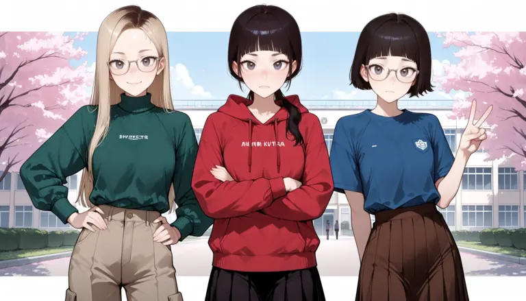 | 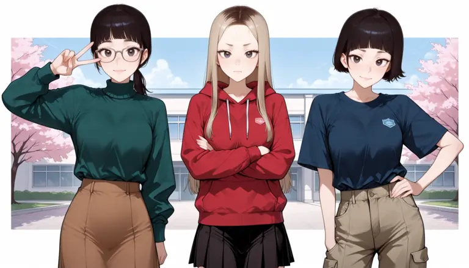 |

注目したいのは `labeled-groups`（21%）と `skill-position-blocks`（71%）の差である。どちらもキャラごとに同じタグ列を持ち、改行で区切っている。違いは、`skill-position-blocks` には各キャラの自然文が 1 文あることだけだ。この 1 文の有無で、属性の正答率は 44% から 94% に上がった。「どの外見が誰のものか」を Anima に伝えているのは、タグの並び順や区切り記号ではなく自然文だと考えられる。

公式モデルカードの「名前の直後に外見を続ける」も、タグ列の中で `kutara natsumi with black hair, ... wearing ...` と書いた `name-then-appearance` では 4% にとどまった。モデルカードの例文は自然文で書かれている。この注意は「自然文の中で、名前の直後に外見を書く」と読むべきだろう。上位の方式はどれも、自然文の中で名前と外見を隣接させている。

`name-then-appearance` には、属性は合っているのに役割だけが逆になる失敗も多かった（s04 で上下逆の肩車）。

| `name-then-appearance`（s04, seed 101）: 外見は合っているが上下が逆 | `hybrid-tags-nl`（s04, seed 101）: 上=なつみ、下=さやか |
|---|---|
| 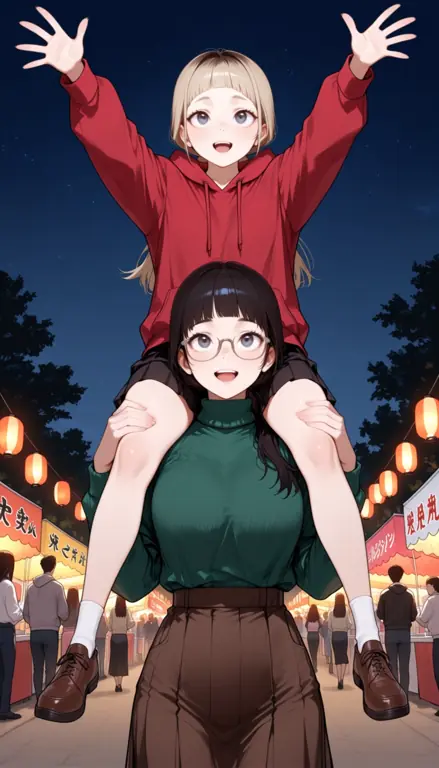 | 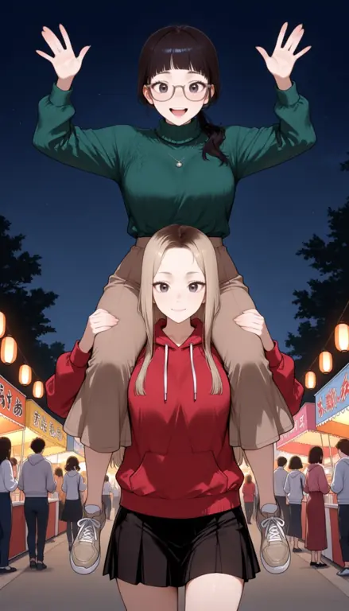 |

### 観察 2: BREAK は効かない

`tags-break` は 1/48 で、`tags-only` の 1/48 と変わらなかった。調査で確認した実装（Forge Neo の Anima 用テキスト処理に BREAK の処理がない）と一致する結果である。Anima では BREAK を書く意味がない。

### 観察 3: キャラごとのブロック構造は「分割コマ」を招くことがある

相互作用のない 2 人並び（s01）では、`skill-position-blocks` と `image-side-blocks` が 4 枚とも、背景の違う 2 枚を左右に並べた分割コマになった。人物の外見と位置は合っているが、1 枚の絵になっていない。

| `skill-position-blocks`（s01, seed 202）: 左右で別の絵になる | `hybrid-tags-nl`（s01, seed 202）: 1 つの場面 |
|---|---|
| 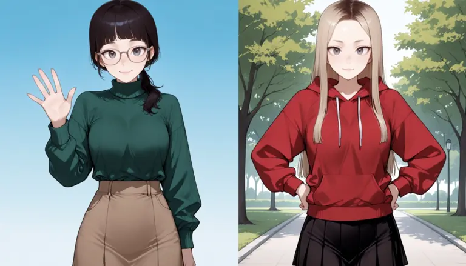 | 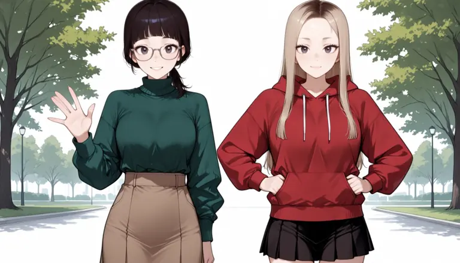 |

同じ s01 でも、自然文を 1 段落にまとめた方式（`hybrid-tags-nl`、`nl-sentences`、`interaction-relations`）は 4/4 で 1 枚の場面になった。キャラの記述を位置語の見出しで画面ごとに区切ると、モデルが「キャラごとに別のコマ」と解釈することがあるようだ。背中合わせやハイタッチのように相互作用を明記したシーンでは、同じ構造でも分割は起きなかった。3 人の並び（s02）でも分割は起きていない。

`image-side-blocks` には、俯瞰の 3 人（s09）でなつみが 2 人描かれて 4 人になる失敗もあった（4/4）。

### 観察 4: 3 人の構図では人数を数え間違えやすい

2 人の構図では、`hybrid-tags-nl` と `nl-sentences` が 28/28 で全部成功した。3 人になると、どの方式も成功は 20 枚中 13 枚以下に落ちる。

主な失敗は、人数が 4 人になることである。s07（縦積み）では自然文系の方式で 4 段のタワーが多く出た。s08（サイズ差）では遠景に余分な小人物が描かれた。人数の正答率が最も高かったのは、キャラごとにタグ列を持つ `skill-position-blocks`（98%）である。3 人の構図での成功数も、`skill-position-blocks` と `interaction-relations` が 13/20 で最多だった（差は小さい）。

### 観察 5: 自然文があれば難しい構図も通る（ただし限界もある）

肩車（s04）、逆さま（s06）、俯瞰（s09）、煽り（s10）、左右非対称の手（s11）は、自然文系の方式ならほぼ 4/4 で通った。逆さまの人物と正立の人物を並べる s06 でも、`hybrid-tags-nl` と `nl-sentences` は 4/4 だった。

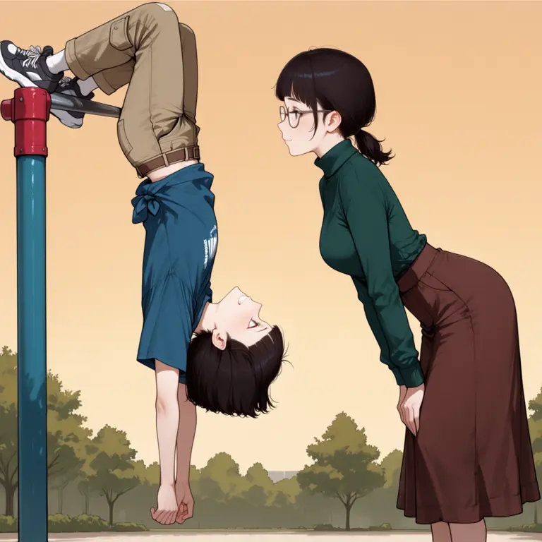

一方で、次の 2 つはどの方式でも成功しなかった。

- **s07 3 人の縦積み**: 上下の順序が合った画像は `skill-position-blocks` と `image-side-blocks` で 4/4 あった。それでも「中段の人物が上の人物の脚を持つ」などの細部と人数がそろわない。成功は全方式あわせて 36 枚中 5 枚だった。

  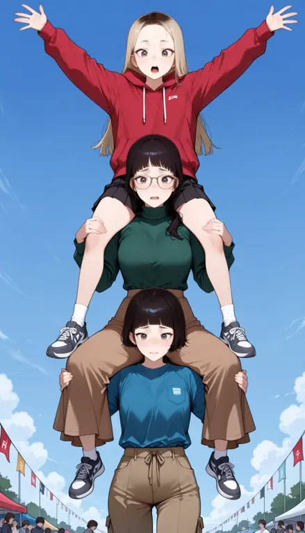

- **s08 前景と遠景の極端なサイズ差**: 自然文系の方式は前景にさやかを大きく置けた。しかし遠景の 2 人が大きすぎるか、遠景に余分な人物が増える。タグ系の方式では、前景がなつみとあきの混ざった人物になった。成功は 36 枚中 1 枚である。

持ち物の所属（s12）では、`interaction-relations` が 4/4 で唯一全部成功した。「黄色い傘は左の子のもの」のように、持ち物と持ち主を最後に言い直す文が効いた可能性がある。

### コンタクトシート

各シーンの全 36 枚。行が方式、列が seed で、緑枠が成功、赤枠が失敗である。

<details>
<summary>s01〜s12 のコンタクトシートを開く</summary>

#### s01 2人並び（基準）
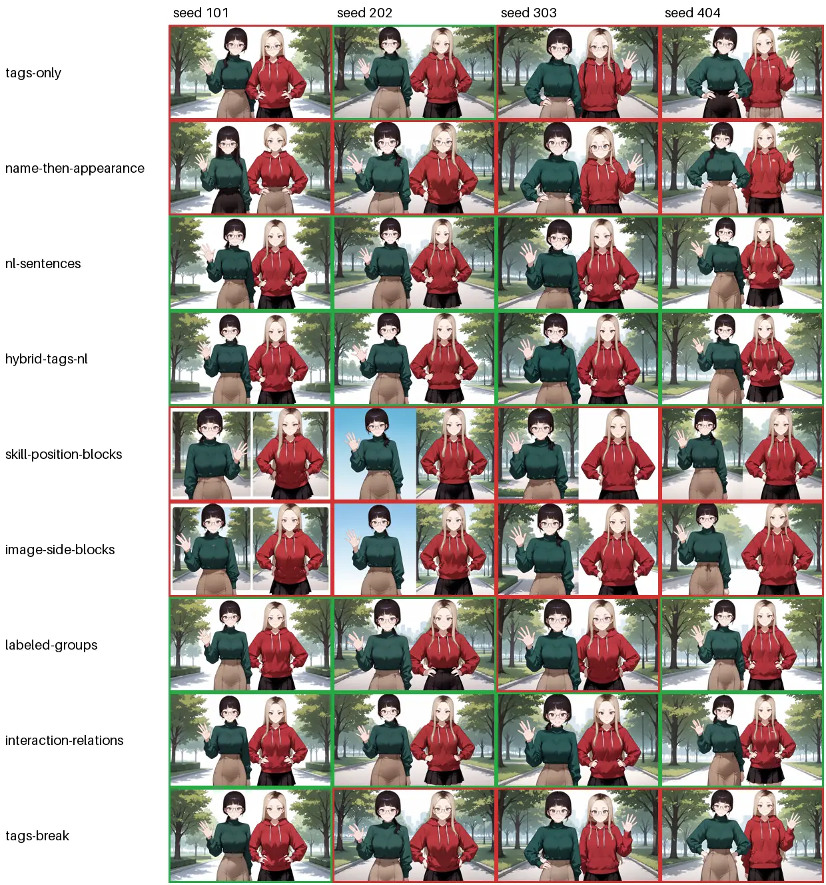

#### s02 3人並び・別々のポーズ
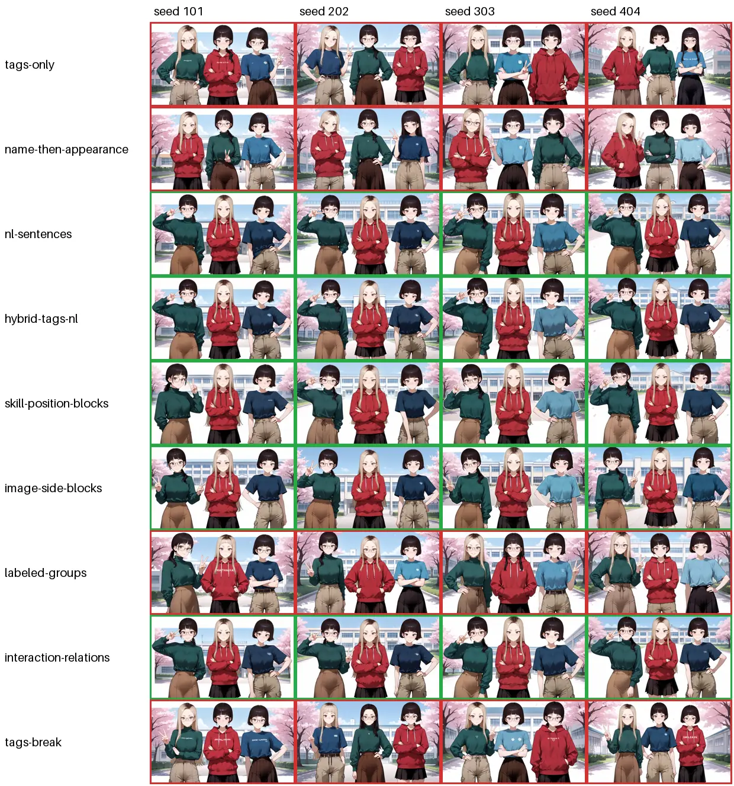

#### s03 背中合わせ
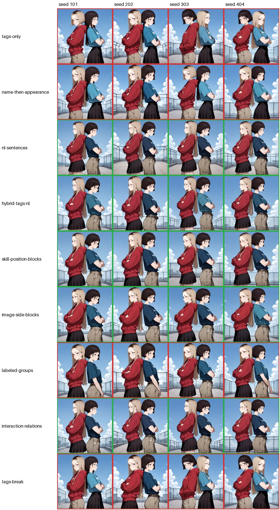

#### s04 肩車
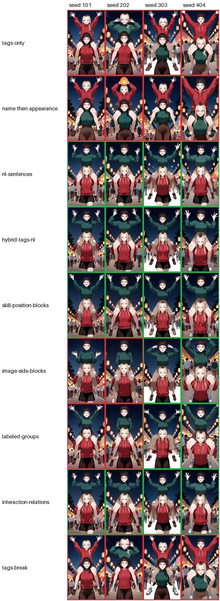

#### s05 お姫様抱っこ
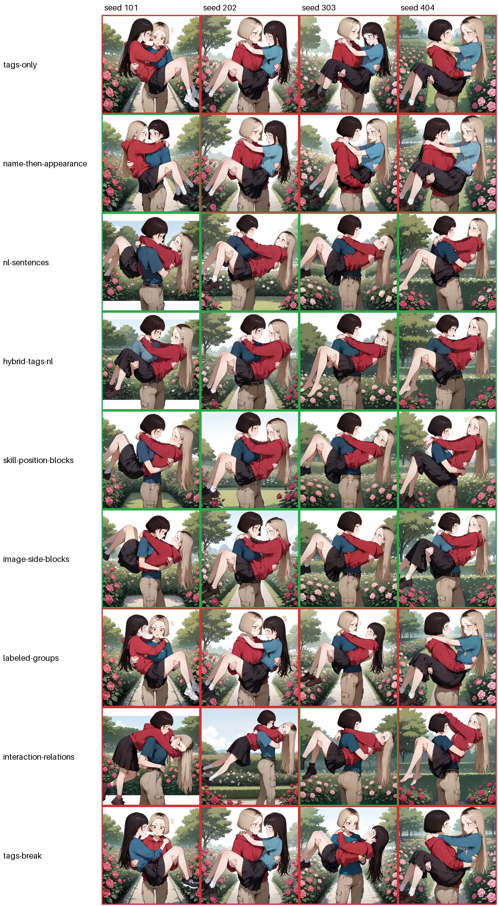

#### s06 逆さまの人物と正立の人物
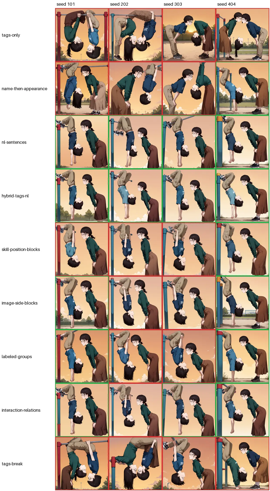

#### s07 3人の縦積み（肩車タワー）
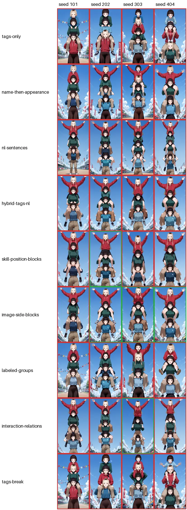

#### s08 前景と遠景の極端なサイズ差
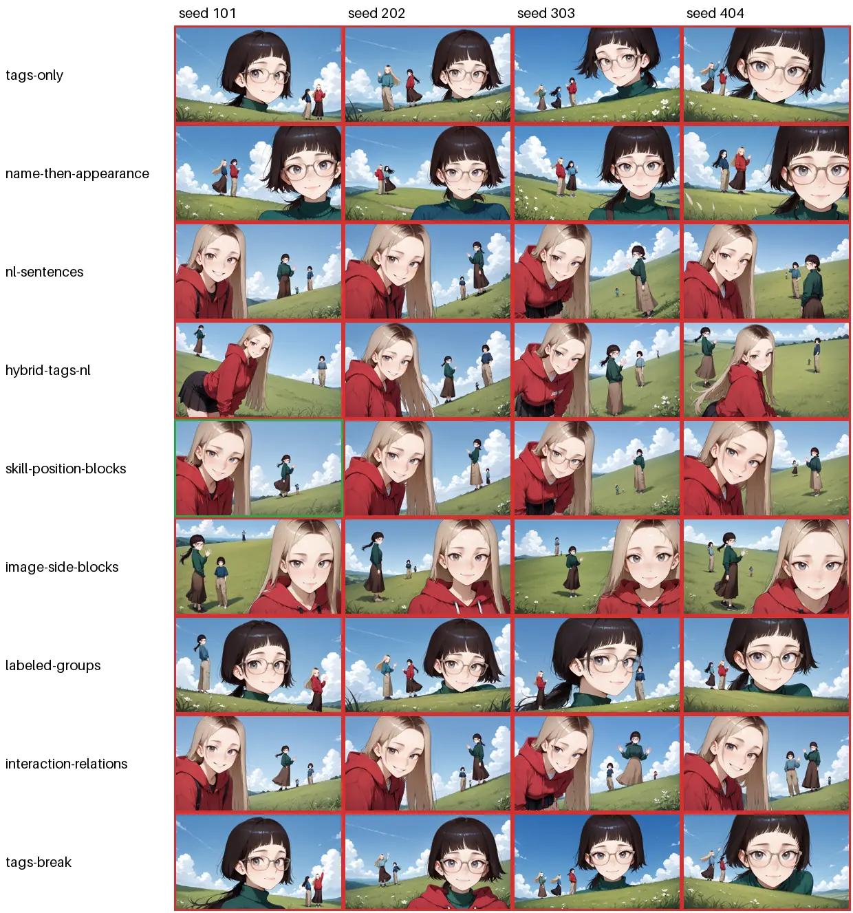

#### s09 真上からの俯瞰（寝転ぶ3人）
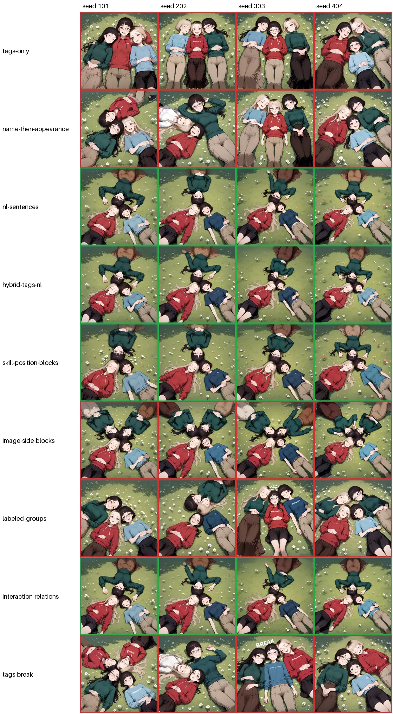

#### s10 極端な煽り（見下ろす2人）
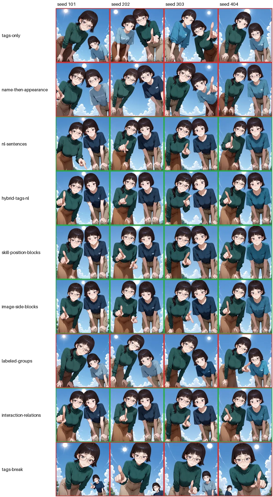

#### s11 左右非対称の手（ハイタッチ）
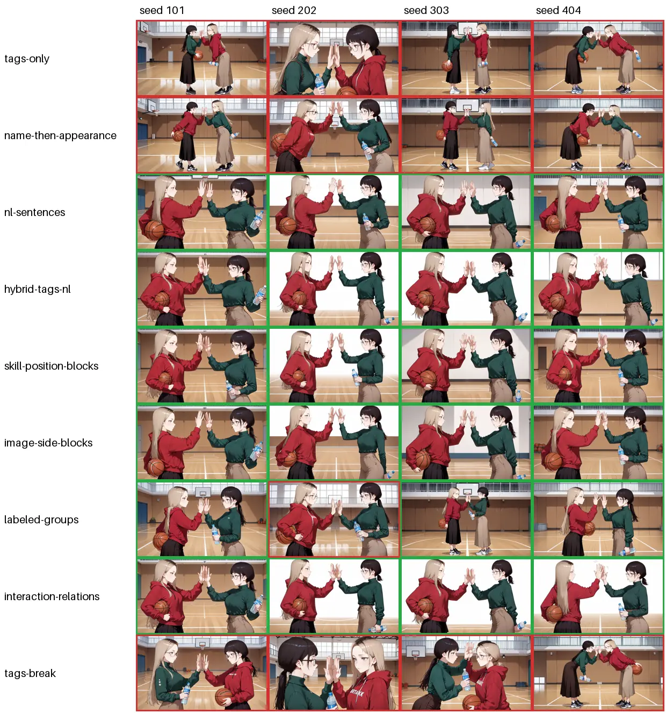

#### s12 持ち物の所属（色の入れ替わり誘発）
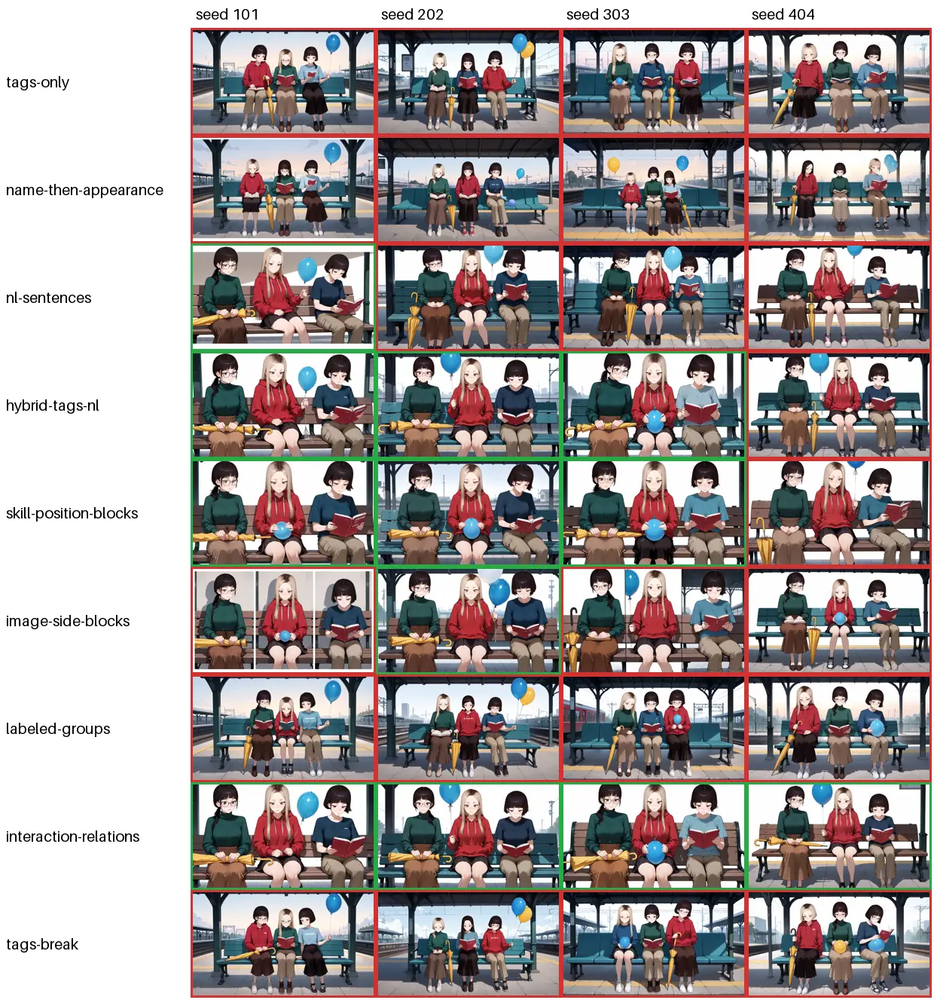

</details>

## この実験の限界

- **1 条件 4 seed** の小さな実験である。上位 4 方式の順位は入れ替わりうる。
- キャラクターは 1 つの LoRA で学習した 3 人に限られる。版権キャラをキャラ名タグだけで呼ぶ場合とは、名前と外見の結びつき方が違う可能性がある。
- 判定は目視で、5 項目の 0/1 を評価者が付けた。評価者には方式名を伏せたが、基準の境界（「指差し」「脚を持つ」の見え方など）には判断が入る。判定基準は途中で 2 回明確化した（服の丈の違いを許容する、ショットサイズを構図の判定に使わない）。その際、既に判定したシーンも新しい基準で見直した。
- ベース版モデル・ER SDE・30 ステップ・CFG 4.5 の 1 条件だけで試した。Aesthetic 版やサンプラーを変えた場合は確かめていない。
- 領域指定（Regional Prompter など）は環境の都合で比較していない。

## 推奨プラクティス

検証結果から、2〜3 人を描くときの書き方を次のように勧める。

1. **キャラの描写は自然文で書く。** タグ列だけで書かない。ラベル・改行・`BREAK`・`with` でタグ列を区切っても、属性の混線は防げない（成功率 1〜21%）。
2. **自然文の中で「位置 → 名前 → 外見 → 服装 → 動作」を 1 文にまとめる。** 例: `On the left, kutara natsumi, a girl with black hair tied in a low ponytail and round glasses, wearing a green turtleneck sweater and a brown long skirt, waves at the viewer with her right hand raised.`
3. **品質・人数・キャラ名・カメラ・背景のタグを先頭にまとめ、キャラの自然文はその後ろに 1 段落で続ける**（`hybrid-tags-nl`）。2 人の構図では、この書き方が 28/28 で全部成功した。
4. **相互作用や持ち物は、最後にもう一度文で言い直す。** 例: `The yellow umbrella belongs to the girl on the left, ...` `interaction-relations` は s12（持ち物の所属）で唯一 4/4 だった。
5. **`BREAK` は使わない。** Anima では区切りとして機能しない。
6. **3 人の構図は、人数が 4 人に増える失敗を前提に seed を回す。** ネガティブの `duplicate, twins, clone` を入れても 4 人になる例が残った。3 人の縦積みや前景・遠景の極端なサイズ差は、プロンプトだけでは成功率が低い（5/36、1/36）。
7. **キャラごとにブロックを分ける書き方を使うなら、相互作用のない並びで分割コマにならないか確かめる。**

## スキルへの反映案

`skills/anima-prompt/SKILL.md` に対する具体的な修正案である。修正そのものと、修正版での再検証は次の作業で行う。

1. **「プロンプト構造（固定順序）」と「出力1: prompt.yaml」のテンプレートを `hybrid-tags-nl` 型に変える。**
   - 1 行目: 品質・メタ・年・安全タグ、人数タグ、登場キャラのトリガー（名前）、カメラ・構図タグ、背景・光タグ
   - 2 行目以降: 全体シーン文 1 文に続けて、キャラごとに「位置語, 名前, 外見, 服装, 動作.」の 1 文を、改行せず 1 段落で並べる
   - 根拠: 成功率 81% で 1 位（現行 71%）。s01 の分割コマが起きず、2 人の構図で 28/28
2. **キャラブロックの「Danbooru タグ列」行をやめる。**
   - 根拠: 自然文があれば外見は伝わる。タグ列だけを残した `labeled-groups` は 21% だった。現行の分割コマは、見出しとインデントでキャラを画面ごとに区切る構造が原因と考えられる
   - ただし 3 人の構図では、現行（タグ列あり）の成功が 13/20、`hybrid-tags-nl` が 11/20 で、現行のほうが人数の正答率も高い（98% と 90%）。3 人以上でタグ列を残すかどうかは、次の作業の再検証で確かめる
3. **相互作用・持ち物の所属を言い直す文をテンプレートの末尾に任意で置く。** `interaction-relations` の要素を取り込む（根拠: s12 で 4/4）。
4. **「キャラクターの描き分け（重要）」の記述を改める。**
   - 「位置ブロック構造で混線を防ぐ」は、「自然文の中で名前と外見を隣接させて混線を防ぐ」に直す
   - 「名前の直後に外見」は、タグ列の中ではほぼ効かず（`name-then-appearance` 4%）、自然文の中で効くと明記する
   - 「3 人までは安定」は、「2 人は安定、3 人は人数が増えるなどの失敗が増える（成功率は最良でも 65%）」に弱める
5. **「`BREAK` タグは Anima では効果なし」は検証で裏付けられた。** 根拠として残す（`tags-break` 2%、`tags-only` 2%）。
6. **カメラ・構図の節に、プロンプトでは届きにくい構図を書き添える。** 3 人の縦積みと、前景・遠景の極端なサイズ差である。
7. **差が出なかった点は変えない。** 上位 4 方式（`hybrid-tags-nl`、`interaction-relations`、`nl-sentences`、`skill-position-blocks`）の間の差は統計的に有意ではない。自然文の書き方の細部（主語をくり返すか、`To be clear` で再掲するか）を厳密に規定する根拠はない。

## 再現方法

[`experiment/`](experiment/) に、条件の定義と生成・評価の手順をすべて置いた。

| ファイル | 内容 |
|---|---|
| `characters.yaml` | 3 人の外見・服装の定義 |
| `scenes.yaml` | 12 シーンの定義（位置・ポーズ・カメラ・背景・成功の条件） |
| `params.yaml` | 生成パラメータ（モデル・サンプラー・ネガティブなど） |
| `build_prompts.py` | 方式ごとのテンプレートで `prompts/` を組み立てる |
| `prompts/` | 実際に使った全プロンプト（シーン × 方式、キャラ参照画像用） |
| `generate.py` | sdctl で全条件を生成する（seed 101 / 202 / 303 / 404） |
| `prepare_eval.py` | 方式名を伏せた評価用グリッドを作る |
| `eval_rubric.md` | 評価基準 |
| `aggregate.py` | 判定 CSV を集計して `results.csv` と `summary.md` を作る |
| `make_figures.py` | コンタクトシートと代表例の画像を作る |
| `results.csv` | 全 432 枚の判定結果 |

キャラ紹介の画像は `prompts/_ref/` のプロンプトを 1024×1024、seed 2 で生成したものである。
